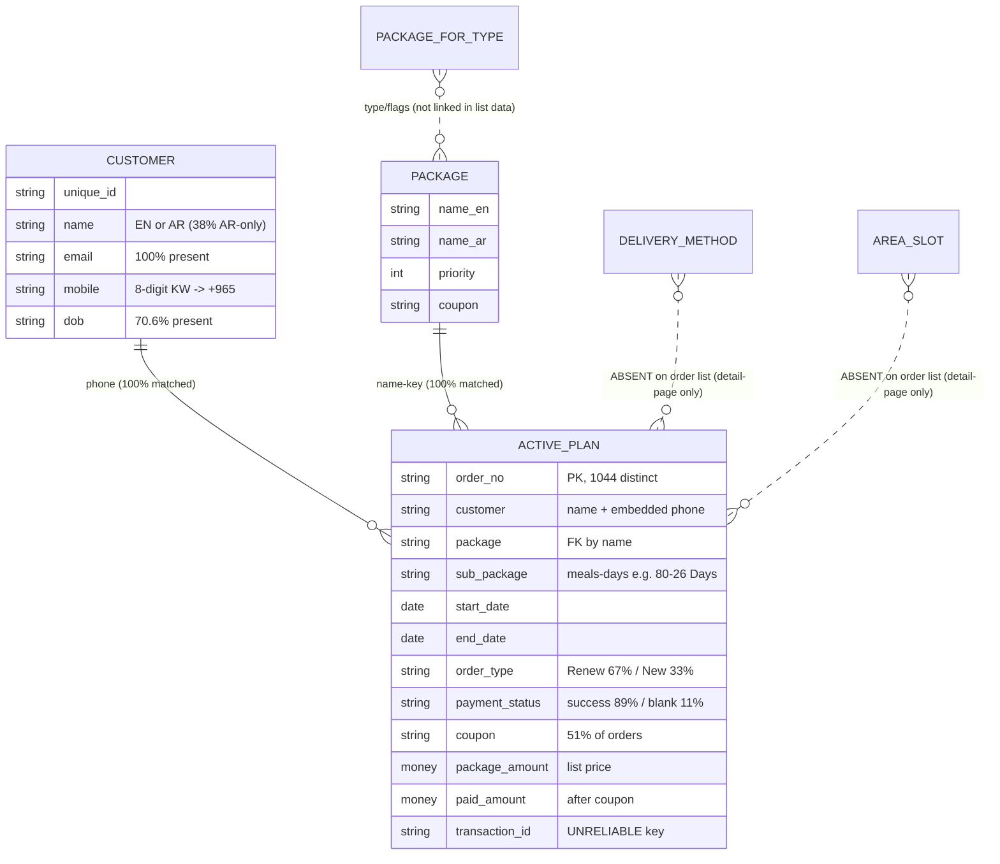

# Deep Legacy Order Analysis

**Date:** 2026-06-14 · **Status:** Analysis only — **no import, no apply, no staging mutation** · **Owner:** Migration Operator
**Input:** the read-only legacy extraction of 2026-06-14 (`tools/legacy-migration/CALIBRATION_NOTES.md`) — **20,151 customers + 1,044 active orders** + catalog masters, on the VPS (`migration-output/<stamp>/`, gitignored).
**Purpose:** understand the real structure and quality of active orders **before** the M19 dry-run, so the dry-run is reviewed against known facts, not surprises. All figures are computed aggregates; **no PII is reproduced** (example phones masked).

> **Headline:** the active-plan dataset is **clean and highly migratable** — 1,044/1,044 orders resolve to a customer and a catalog package, 0 invalid dates, 0 duplicate order numbers. The real work is on the **customer side** (Arabic-name policy + ~549 dedup groups + 3 placeholder phones) and on **data absent from the order list** (delivery/area/slot, package price/duration). None of these block the dry-run; they shape the mapping + merge rules below.

---

## 1. Dataset overview

| Set | Rows | Notes |
|---|--:|---|
| Customers | 20,151 | full legacy user base |
| Active orders (plans) | 1,044 | `/orders/list/Active` |
| Paused orders | ~1 | ajax returned 0; 1 visible via DOM (negligible) |
| Packages (catalog) | 7 | `/package` |
| Package-for-types | 7 | incl. Friday-off / new-customer flags |
| Delivery methods | 4 | "Leave the box", "Ring the bell…", "Call upon arrival", "Deliver 1 day before" |
| Products | — | **not extracted** (`/products` times out >45s) |

## 2. Entity relationships (as extracted)

**Resolvable today:** Customer ⇄ Active-Plan (phone) and Package ⇄ Active-Plan (name) are both **100%**. **Not resolvable from the extract:** delivery method, area, slot (order-detail pages only).

## 3. Findings by requested dimension

### 1. Customer ↔ order relationships
- **1,044 / 1,044 (100%) orders matched** to an extracted customer by normalized phone.
- 1,033 distinct customers hold the 1,044 active plans.
- **11 customers hold 2 active plans each** (max 2); see #12.

### 2. Package distribution (orders)
6 distinct package names in use, **all map to the 7-item catalog**:
| Package | Orders | % |
|---|--:|--:|
| 630 – 1730 calories (almost) | 448 | 42.9% |
| (150p-150c) 620-2240 calories (almost) | 304 | 29.1% |
| 720- 1920 calories (almost) | 173 | 16.6% |
| (200p-200c) 1020-3520 Calories (almost) | 68 | 6.5% |
| (150p-200c) 876-3400 calories (almost) dry food | 50 | 4.8% |
| Kids package | 1 | 0.1% |
1 catalog package — "(150p-150c) 620-2240 (Stax × nutreeze)" — has **0 active orders**.

### 3. Sub-package distribution
22 distinct sub-packages, all in the form **`<meals>-<days> Days`**. Top: 80-26 Days (202), 150-26 Days (159), 80-20 days (101), 100-26 Days (86), 80-30 Days (78), 150-20 days (69), 80-13 Days (55). → encodes **meal count + duration** (recoverable; see mapping rules).

### 4. Active vs paused
1,044 active (100% of the set). Paused ≈ 1 (separate small list). Order-status column is uniformly "success" — it is **not** the plan lifecycle status (that comes from the list page Active/Pause).

### 5. Start/end date patterns
- **0 invalid dates, 0 negative durations, 0 plans already ended.** (Excellent — fully parseable after DD-MM-YYYY→ISO.)
- Duration: median **29 days**, min 12, max 284. Buckets: 8-15 → 94, 16-30 → **626**, 31-60 → 250, 60+ → 74.
- Start month: 2026-06 → 576, 2026-05 → 416, 2026-04 → 37, 2026-03 → 6. **83 plans start in the future** (pre-booked) → generate SCHEDULED days from import date.

### 6. Delivery methods
4 methods exist as a master (delivery **instructions**, not areas): "Leave the box", "Ring the bell and leave", "Call upon arrival", "Deliver 1 day before". **Not present on the order list** → per-order delivery method is unknown from the extract.

### 7. Areas and slots
**Not present in the extracted order data** (order-detail pages only). Cannot be analyzed from this extract — flagged as a gap (#15 / Risk R3).

### 8. Payment status distribution
- payment_status: **success 929 (89.0%)**, blank/missing **115 (11.0%)**.
- order_status: success 1,044 (100%).
- Of the 115 blank-payment orders, **113 have a coupon** and 95 are renewals → mostly coupon-covered, not "unpaid". → finance-review queue at import.

### 9. Coupon usage
- **533 orders (51.1%) carry a coupon**; 57 distinct codes. Top: NUT10 (165), off100 (104), B10 (38), ahmed10 (19), tik10 (16), km10 (16).
- **503 orders paid less than list price; 492 of those have a coupon** (106 fully free, paid=0). → "underpayment" is **coupon discount, legitimate**, not a data gap. Only ~11 underpaid orders lack a coupon → finance review.

### 10. Transaction ID quality
- 2 missing; **435 short (≤4 chars, e.g. "7")**; 572 long (≥12, gateway refs); **16 duplicate-id groups covering 360 extra rows.**
- → `transaction_id` is **not a reliable unique key**; use `order_no` (1,044 distinct). Keep txn_id as evidence only.

### 11. Duplicate customers
- Valid phone on **20,060 / 20,151 (99.5%)**; 91 invalid/missing.
- **552 duplicate-phone groups** (712 extra rows): **505 exact pairs**, 44 groups of 3–9, **3 high-count groups (43, 41, 10)** → placeholder/shared numbers.
- 39 duplicate-email groups (55 extra rows).
- Real duplicate pairs ≈ 549 groups (~2.7% of rows) → within the ≤10% merge-review gate. The 3 placeholder phones must be **excluded** (see merge rules).

### 12. Duplicate active plans
- 0 duplicate order numbers.
- 11 customers hold 2 active plans: **8 have overlapping date ranges (true duplicate-plan candidates)**, 3 are sequential (legitimate renewal-before-expiry).

### 13. Missing package mappings
**0** — every order package normalizes to a catalog package (case/spacing handled).

### 14. Missing customer mappings
**0** — every active order resolves to a customer by phone.

### 15. Missing delivery mappings
**N/A from this extract** — delivery method / area / slot are not on the order list. Must be sourced from order-detail pages or captured at first contact (WF-01). Tracked as Risk R3.

### 16. Orders with invalid dates
**0** (start and end parse for all 1,044; none negative; none already expired).

### 17. Orders with missing payment data
**115 (11%)** have a blank payment_status (113 coupon-linked). 503 paid < list price (492 coupon-explained). Net "needs finance review": the 115 blank-status + ~11 non-coupon underpayments.

### 18. Orders with missing package data
**0** — every order has a package name that maps.

## 4. Top anomalies

| # | Anomaly | Count | Severity | Disposition |
|---|---|--:|---|---|
| A1 | Customers with Arabic-only name (no `full_name_en`) | ~7,700 | High | policy decision: allow AR as primary name, or backfill |
| A2 | Placeholder/shared phones (3 numbers) | 94 rows | High | blacklist from auto-merge |
| A3 | Orders with blank payment_status | 115 | Medium | finance-review queue (mostly coupon-covered) |
| A4 | Overlapping duplicate active plans (same customer) | 8 | Medium | manual review (dup vs household) |
| A5 | transaction_id duplicated / placeholder | 360 dup + 435 short | Medium | don't key on it; order_no is the key |
| A6 | Real duplicate-customer groups (phone) | ~549 | Medium | merge-review queue (≤10% gate OK) |
| A7 | Non-coupon partial payments | ~11 | Low | finance review |
| A8 | Catalog package with 0 active orders ("Stax×nutreeze") | 1 | Low | import anyway (catalog completeness) |

## 5. Migration risks

- **R1 — Arabic-name policy (binding).** ~38% of customers have AR-only names; the new model wants `full_name_en`. Without a policy (allow AR as primary, or transliterate/backfill), ~7,700 customers land in review. *Owner: workshop/sponsor.*
- **R2 — Placeholder phones.** 3 numbers cover 94 customers; phone-only merge would wrongly fuse dozens of distinct people. *Mitigation: blacklist (merge rule M3).*
- **R3 — Delivery/area/slot absent.** Migrated active plans will lack delivery routing → kitchen/dispatch readiness gap. *Mitigation: extract order-detail pages (second pass) or fill at first contact (WF-01).* 
- **R4 — Package master is name-only.** No price/duration/meals on the package list → packages import name-keyed; duration/meals must be parsed from the plan sub-package, price enriched later. *Mitigation: mapping rule P2.*
- **R5 — Products not extracted.** `/products` times out → product catalog incomplete (new system derives products from package composition meanwhile).
- **R6 — Payment ambiguity.** 115 blank-status orders → finance absorbs at import (by design). Low risk, but sizes the finance-review queue.
- **R7 — transaction_id unreliable.** Never use as dedup/idempotency key.

## 6. Recommended mapping rules

| ID | Field | Rule |
|---|---|---|
| MAP-1 | Phone | Kuwaiti 8-digit → `+965` + digits (validated; 99.5% ok). 91 invalid → merge_review. |
| MAP-2 | Date | `DD-MM-YYYY` → ISO (0 failures). Generate FulfillmentDays from `max(start, import_date)`→`end` as SCHEDULED; no past days. |
| MAP-3 | Package | Name-key match, normalized (lowercase, strip non-alphanumeric) → 100% to catalog. |
| MAP-4 | Sub-package | Parse `^(\d+)-(\d+)\s*Days?$` → `meals_count` + `duration_days` (recovers the data the package list lacks). |
| MAP-5 | Order number | Use `order_no` as the unique key; preserve verbatim. **Not** `transaction_id`. |
| MAP-6 | Plan status | Derive from the source list (Active→ACTIVE, Pause→PAUSED). Ignore the "success" order_status column. |
| MAP-7 | Payment | `package_amount` = list price; `paid_amount` = paid (post-coupon). Blank payment_status → `unpaid` + finance-review note. Coupon discount is expected, not a shortfall. |
| MAP-8 | Coupon | Store `coupon_code_frozen` (text only; legacy coupon rules not re-validated). |
| MAP-9 | Delivery/area/slot | **Not available** → import plan address-less; fill at first contact (WF-01) or a detail-page enrichment pass. |
| MAP-10 | off_days | Unknown → `off_days_unverified = true` (ASM-038). |

## 7. Recommended merge (dedup) rules

| ID | Rule |
|---|---|
| M1 | Primary key for dedup = normalized phone (`+965…`). Exact match → `matched` (link, no new row). |
| M2 | ~549 real duplicate-phone groups (505 pairs + 44 small) → **merge_review** queue, never auto-merge. ~2.7% of rows → within the ≤10% gate. |
| M3 | **Blacklist the 3 placeholder phones** (counts 43/41/10) — treat as "no phone": those customers dedup by name+email, never by the shared phone. |
| M4 | Secondary signal: 39 duplicate-email groups → cross-check / raise confidence on a phone-pair merge. |
| M5 | No/invalid phone (91) → name+DOB fuzzy → merge_review (never auto-merge). |
| M6 | Active plans: a customer with 2 plans whose dates **overlap** (8 cases) → review (dup vs household); **sequential** plans (3) → keep both. |

## 8. Estimated migration success rate

| Batch | Scope | Clean (no manual touch) | Needs a review touch (still migrates) | Hard-blocked |
|---|---|--:|--:|--:|
| **Batch 3 — Active plans** | 1,044 | **~98%** (1,044 resolve customer+package+dates) | ~13% pass a queue: 115 payment + 8 dup-plan + ~11 partial (overlapping sets) | **0** |
| **Batch 2 — Customers** | 20,151 | **~62%** VERIFIED (valid phone + EN name) | ~37% import with a name/phone note; ~2.7% merge_review | gated by R1 (AR-name policy) |
| **Batch 1 — Catalog** | 7 pkg + 4 methods + 7 pkg-for | **~100%** (name-keyed) | price/duration enrich later (R4) | products pending (R5) |

**Bottom line:**
- **Active-plan migration is ~98–100% clean** — the cutover-critical Batch 3 is in excellent shape. Expect a modest finance-review queue (≈115) and ~8 duplicate-plan reviews.
- **Customer migration is ~62% "green"**, the rest importable with notes; the **single biggest lever is the Arabic-name policy (R1)** — resolving it moves a large share from review to clean.
- **Dedup is well within tolerance** (~2.7% merge_review vs the ≤10% gate), provided the 3 placeholder phones are blacklisted.

## 9. Pre-dry-run checklist (what to confirm before M19)

- ☐ Decide R1 (Arabic-name policy) — biggest success-rate lever.
- ☐ Confirm the placeholder-phone blacklist (M3) before any customer merge.
- ☐ Accept that 115 blank-payment + ~11 partial → finance-review queue (sized, expected).
- ☐ Plan delivery/area/slot enrichment (R3): order-detail extraction pass or first-contact capture.
- ☐ Note products (R5) remain to be extracted; catalog imports packages/methods now.
- ☐ Then run M19 **dry-run** (no apply) and reconcile its counts against this analysis (orders should report ~1,044 created, 0 unresolved customers, 0 package misses).

**This analysis does not import, apply, or mutate anything.** It is the evidence baseline for reviewing the M19 dry-run.
