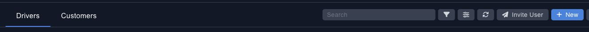
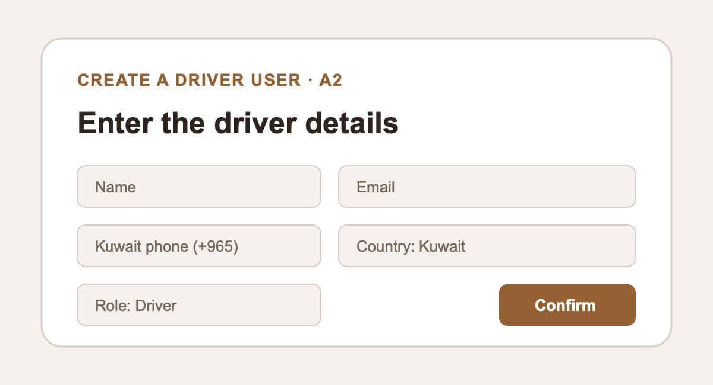
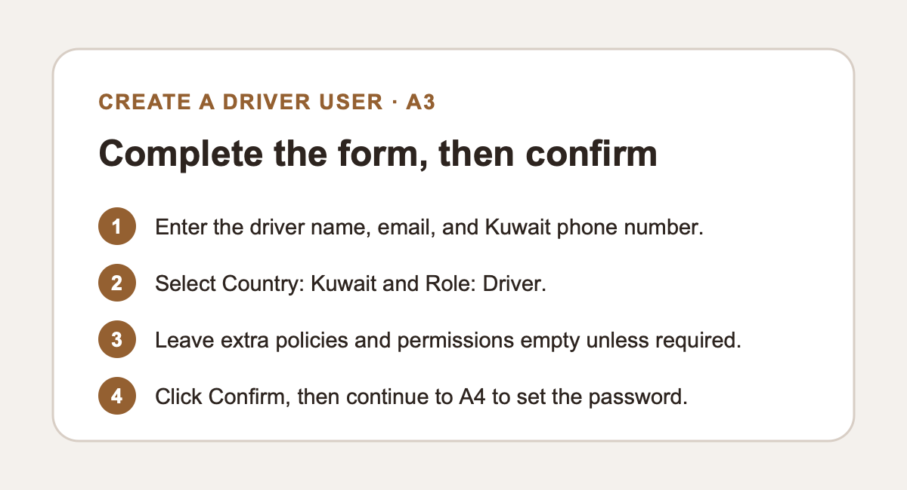
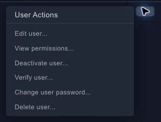
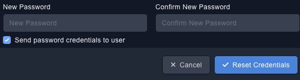
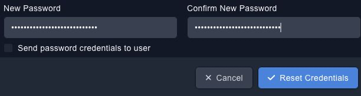
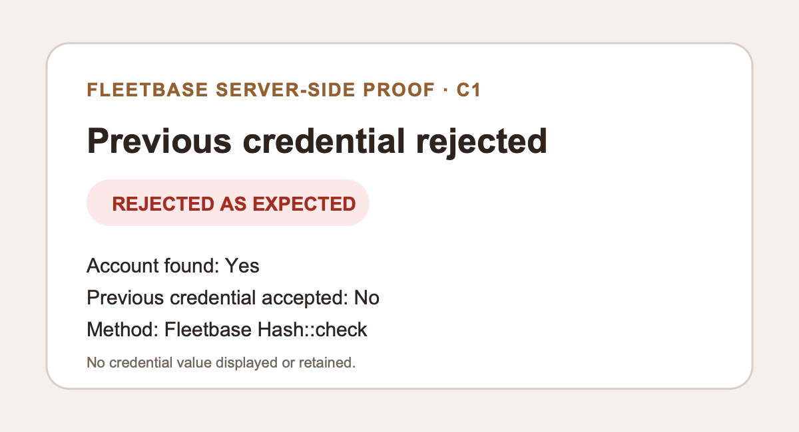
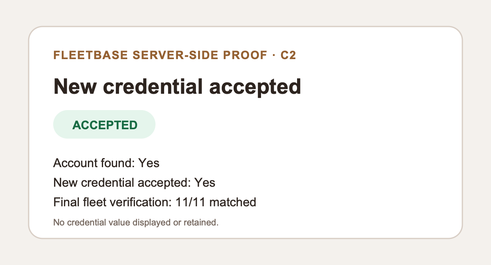

# Fleetbase driver-user and password guide

This gallery is the credential-safe operating guide for Mohamed. Password values are never
shown. The live-console screenshots are tightly cropped; the create-user field maps and
server-side proof cards contain no driver data.

## A — Create a driver user

### A1 — Open IAM → Users → Drivers, then click **New**

### A2 — Enter the driver details

### A3 — Select Kuwait and the Driver role, then confirm

### A4 — Open the new user's action menu and choose **Change user password...**

## B — Reset a driver's password

### B1 — Search for the driver, open the row action menu, and choose **Change user password...**

### B2 — Enter the new password twice

The console checks **Send password credentials to user** by default. Uncheck it while the
Fleetbase mail queue follow-up remains unresolved.

### B3 — Confirm both fields are masked, keep email delivery unchecked, then click **Reset Credentials**

## C — Reset verification

### C1 — The previous password is rejected

### C2 — The new password is accepted

The C checks were performed server-side with Fleetbase `Hash::check`. The controlled previous
value failed, the final value passed, and all 11 final driver passwords matched. All temporary
proof files were deleted from the workstation, VPS, and application container.

Mohamed may rotate any or all 11 passwords later using B1–B3. The current simple
passwords can remain in place for today's app handover.
