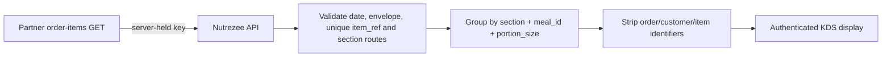

# WP-KDS-01 — Kitchen Display Release 1: section totals

**Date:** 2026-08-08

**Authority:** A30

**Mode:** Build

**Status:** BUILD COMPLETE — draft PR #45; not deployed

## Outcome

A separate bilingual Kitchen Display web app shows only the total quantity required by each
kitchen section for a selected delivery date. It does not show tickets, customers, orders,
addresses, phones or item references and it cannot write a production status.

## Verified inputs

- Partner Kitchen & Labels v2 exposes read-only `GET /integration/order-items` with exact
  delivery-date and kitchen filters, pagination, stable `item_ref`, documented `meal_id`,
  quantity, portion and section assignments.
- A29 already established the protected server-only Partner base URL/key and the live-envelope
  validation pattern. The KDS browser never calls Partner directly.
- Existing Nutrezee staff sessions and `kitchen.board.read` permission are the authentication
  and authorization boundary.
- The user requested totals only for the current release and will answer workflow questions later.

## Release 1 flow

## Contract

`GET /kitchen/section-totals?date=YYYY-MM-DD&kitchen=main`

- Requires a valid server-side staff session and `kitchen.board.read`.
- Reads only the date and kitchen requested.
- Returns dynamic sections with bilingual names, section total and meal/portion totals.
- A physical item assigned to multiple sections contributes its quantity to every section.
- An item with no route contributes to a visible synthetic `unrouted` lane.
- Summary distinguishes source meal quantity from section-work quantity because multi-section
  work can make the latter larger.
- Upstream auth/unavailability returns a fail-closed 503. Invalid upstream data returns 502.
  No stale, estimated, partially parsed or name-inferred total is returned.

## Security and privacy invariants

1. Partner key is loaded only by the API from the protected A29 environment variables.
2. Only GET is issued to Partner; redirects are rejected and pagination is bounded.
3. The production Partner hostname/path are pinned for environment construction.
4. API output contains no `item_ref`, order number, customer identity/contact/address or key.
5. Duplicate physical item references, malformed sections and cursor loops fail closed.
6. No database migration/table or write path is added by this release.

## Assumed and reversible defaults — ASM-055

- Group key: exact `meal_id` + `portion_size` inside each upstream section.
- Date: Kuwait today; operator can select another date.
- Kitchen: `main`; operator can enter another safe kitchen code.
- Refresh: automatic every 60 seconds plus manual refresh.
- Language: Arabic-first with instant English toggle.

## Explicitly deferred questions

- Chef/task status workflow and whether sections acknowledge or complete work.
- Ticket-level/order-level detail, exceptions and preparation sequencing.
- Per-section devices, kiosk ownership and named kitchen accounts.
- Recipe/component/gram calculations, inventory, waste and forecasting.
- Notifications, sound, SLA colors, production cutoffs and automatic release.
- Final public hostname and staging/production rollout.

None of these deferred items is silently implemented in Release 1.

## Definition of done

- API source/pagination/validation/aggregation unit tests pass.
- Controller contract and RBAC path pass.
- PII-stripping and visible-unrouted regressions pass.
- API, shared package and KDS TypeScript checks pass.
- Monorepo lint, build and all Vitest suites pass.
- KDS nginx and container image are CI-validated.
- Branch `build/wp-kds-01-section-totals` is pushed at `28d1655`; CI run 31245574687
  passed 14/14 including the KDS image and nginx checks.
- Draft PR #45 is stacked on the A29 label branch/PR #44. Deployment remains a separate unit.
